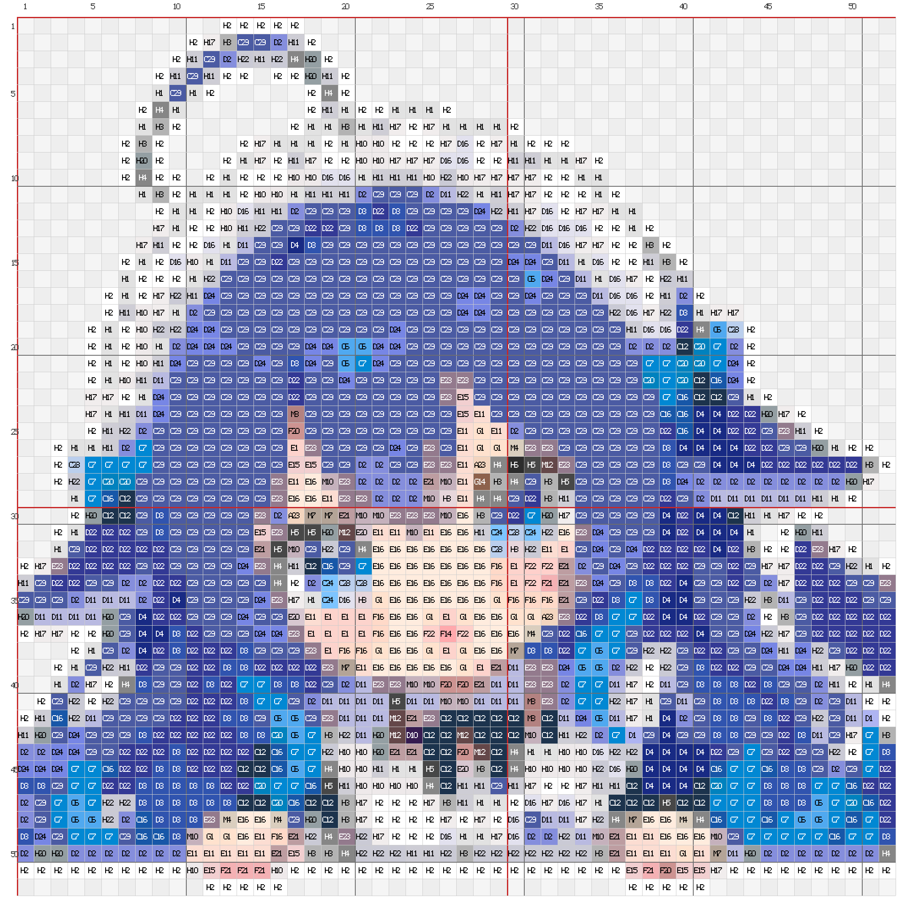

# MirrorPin · 拼豆图纸生成工具

MirrorPin 把图片转换为可直接发布和采购的拼豆图纸：输出带色号、坐标、板界与内嵌材料清单的 PNG，并可另存 `code,hex,count` CSV。核心算法为纯 TypeScript，可在 Node.js、CLI 和浏览器 Web Worker 中运行。

> **🌐 在线体验**：<https://mirrorpin.emaostudio.online/> — 浏览器本地生成，图片不上传，打开即用。

## 0.3.0 重点

- **统一干净模式**：弱 Guided 平滑 + 线性光、Alpha-aware 精确面积采样 + top-K MARD CIEDE2000 候选 + 边缘敏感 Potts/ICM 空间优化。
- **减少无意义杂色**：低置信度小区域清理、空间感知 `minBeads`、能量感知 `maxColors`，避免全图盲目替换。
- **保护真实细节**：强边缘、文字、一格线条、窄长结构和高置信度高光不会按普通孤点处理。
- **统一 Alpha**：连续 coverage 用于颜色积分；`coverage >= 0.5`（等价于源 Alpha 阈值 128）才进入拼豆标签域；透明隐藏 RGB 不污染边缘。
- **浏览器本地运行**：生成在 Web Worker 中执行，带真实阶段进度、取消、诊断和 stale-result 防护；图片处理和图纸生成均在浏览器本地完成。
- **MARD 色卡**：内置 MARD 291 与标准 MARD 221。

## 运行效果展示

下面使用同一张示例图片展示 104×104、78×78 和 52×52 三种板规的生成结果。输出图包含拼豆网格、色号、坐标、板界和材料清单，可直接下载发布或据此采购材料。

<table>
  <tr>
    <td align="center"><strong>原图</strong></td>
    <td align="center"><strong>104 × 104 图纸</strong></td>
  </tr>
  <tr>
    <td></td>
    <td></td>
  </tr>
  <tr>
    <td align="center"><strong>78 × 78 图纸</strong></td>
    <td align="center"><strong>52 × 52 图纸</strong></td>
  </tr>
  <tr>
    <td></td>
    <td></td>
  </tr>
</table>

> 示例展示同一张原图在不同板规下的生成效果。屏幕显示可能存在色差，实际颜色请以 MARD 实物色卡为准。

## 安装与验证

```bash
git clone https://github.com/lmy414/MirrorPin.git
cd MirrorPin
npm install
npm run build
npm test
npm run test:regression
npx tsc --noEmit
```

## CLI

```bash
node ./dist/cli.js <input> -o <output.png> [选项]
node ./dist/cli.js <input> --materials <materials.csv> [选项]
node ./dist/cli.js --help
```

CLI 0.3.0 默认：`guided + area + spatial on + top-K 8`，预降色关闭，抖动关闭。

| 选项 | 默认 | 说明 |
|---|---:|---|
| `--max-side <n>` | 64 | 网格最大边长 |
| `--palette <mard291\|mard221>` | mard291 | 使用的 MARD 色卡 |
| `--smooth <none\|gauss\|guided\|l0\|l0soft>` | guided | 源图保边平滑 |
| `--scale <area\|box\|dpid>` | area | 目标网格采样；`box` 为 area 兼容名 |
| `--colors <n>` | 0 | 可选预降色，0 为关闭 |
| `--spatial-strength <n>` | 0.35 | Potts 空间平滑强度 |
| `--spatial-top-k <n>` | 8 | 每格 CIEDE2000 候选数 |
| `--cleanup-size <n>` | 2 | 低置信度小区域清理上限 |
| `--no-spatial` | 关 | 关闭空间优化，使用兼容逐格匹配 |
| `--min-beads <n>` | 0 | 空间分量级稀有色合并阈值 |
| `--max-colors <n>` | 不限 | 最终色号预算 |
| `--remove-bg <none\|flood>` | none | 源图安全置信度背景 flood |
| `--dither` | 关 | Floyd–Steinberg 风格分支；不可与 spatial 同开 |
| `--no-legend` | 关 | 关闭 PNG 右侧内嵌材料清单 |

示例：

```bash
node ./dist/cli.js "./input.png" \
  -o "./output/pattern.png" \
  --materials "./output/materials.csv" \
  --palette mard221 --min-beads 5
```

## 算法主管线

```text
validate
→ source foreground/background mask
→ mask-aware subject crop + aspect fill
→ transparent RGB extension
→ optional Guided/Gauss/L0 smooth
→ optional deterministic pre-quantization
→ linear-light Alpha-aware area/DPID sampling to GridSamples
→ top-K MARD CIEDE2000 candidates
→ edge-sensitive deterministic Potts/ICM
→ confidence-aware connected-component cleanup
→ energy-aware maxColors/minBeads
→ Grid + diagnostics
```

公共入口：

```ts
import {
  generatePatternBead,
  generateForBoard,
  MARD221,
  renderPatternPng,
  countGridMaterials,
} from 'mirrorpin-core';
```

`generatePatternBead()` 是唯一产品主管线。`src/core/pipeline.ts` 的旧多管线入口仅保留兼容，不用于 CLI、Webapp 或 minitool 默认生成。

## Webapp

> 线上部署版（与仓库同版本）：**<https://mirrorpin.emaostudio.online/>**

在仓库根目录运行：

```bash
npm run build:webapp
npm run serve:webapp
```

打开 [http://localhost:5173/](http://localhost:5173/)。也可以直接访问根级页面入口：`/generating`、`/result`、`/error`；它们会转入对应的物理页面，因此普通静态服务器不需要 SPA rewrite。Webapp 使用 IndexedDB 在页面间保存本地图片、参数、Grid、diagnostics、schema version 和 algorithm version；所有计算仍在浏览器内完成。

三种质量档：

- `standard`：默认空间一致性，不强制删除低用量色。
- `less`：提高空间强度并启用 `minBeads=5`。
- `minimal`：更强空间约束、`minBeads=10`，并使用 48 色最终预算。

生成可上传到普通静态服务器的自包含包：

```bash
npm run build:webapp-deploy
```

产物：`output/mirrorpin-webapp-deploy.zip`。ZIP 根目录含 `index.html` 以及 `generating/`、`result/`、`error/` 物理路由目录，无需 rewrite；服务器需将 `.mjs` 返回为 JavaScript MIME。

## Minitool

```bash
npm run build:minitool
```

产物：`output/mirrorpin-minitool.zip`。minitool 与 Webapp 使用同一 Worker 协议、算法版本和质量 profile。

## 验收工具

```bash
npm run build
npm run acceptance -- --boards 52x52,78x78,104x104,78x52 --runs 3
```

验收输出位于 `output/acceptance/<timestamp>/`，包含：

- `manifest.json`、`metrics.json`、`timing.json`；
- 每素材/板规的 baseline 与 clean PNG、指标和三次 SHA-256；
- `comparison-sheet.png`。

验收覆盖平坦区域杂色、边缘保留、细线还原和结果可复现性，并覆盖 52×52、78×78、104×104 与 78×52 板规。

最近一次完整验收（2026-09-01）覆盖 20 个素材/板规案例，连续三次生成结果一致，全部质量检查通过。报告位于 `output/acceptance/2026-09-01T14-28-33-628Z/manifest.json`。

## 输出说明

- PNG：标题、每格色号、坐标、网格线、板界、材料清单。
- CSV：`code,hex,count`，按用量降序。
- MARD 色值是屏幕近似值，采购与成品颜色以实物色卡为准。

## 技术栈

| 层 | 技术 |
|---|---|
| 核心 | TypeScript，浏览器/Node 通用纯计算 |
| CLI | Node.js + sharp |
| Webapp/minitool | 静态 HTML/JavaScript + Web Worker + IndexedDB |
| 构建 | tsup + esbuild + 本地 Tailwind CLI |
| 测试 | Vitest |

## 版权与致谢

项目遵循 MIT License。

- [bead-pattern](https://github.com/wuZHeBoy/bead-pattern)（MIT）：主体裁剪、面积采样、CIEDE2000 配色与后处理思路，MirrorPin 以 TypeScript 重写并继续演进。
- [pyxelate](https://github.com/sedthh/pyxelate)（MIT）：仅用于早期调研，没有进入产品主管线。
- `MARD 291/221` 色号与屏幕 RGB 为公开事实型色卡数据；实物颜色以品牌色卡为准。
